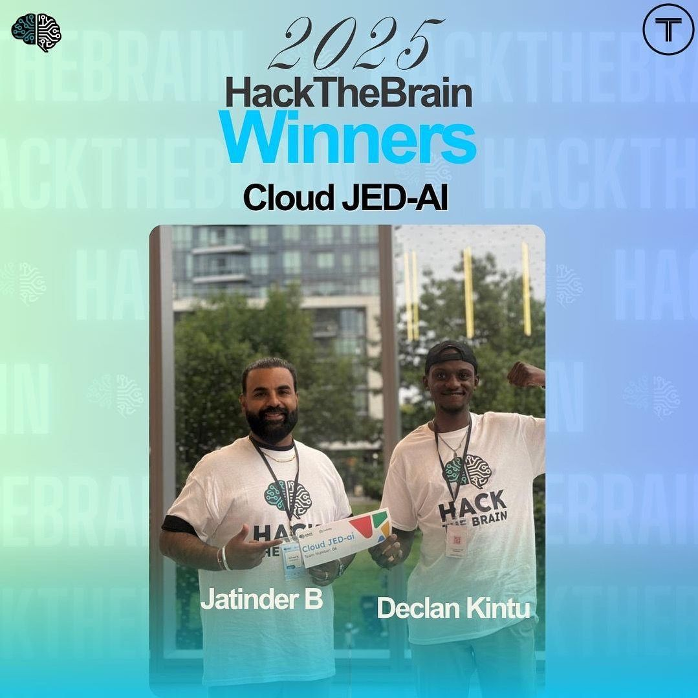
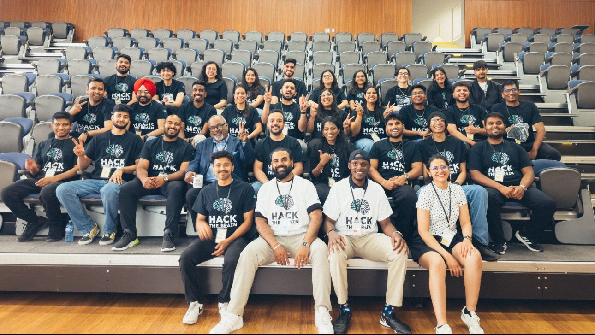

# 🎯 TalentUnlock - AI-Powered Career Bridge for Immigrants

**HackTheBrain 2025 Project** | **Category**: Community – Newcomers & Access to White-Collar Work

  
  [](https://share.synthesia.io/14edb68b-71cd-47c9-9121-fcb21350af7b)
  [](https://www.loom.com/share/6d23408e78664d118a5c7b4781539fca?sid=1e781504-a732-4247-bffc-58eb81083896)
  
  [](https://gamma.app/docs/by-Cloud-JED-AI-4fo7g3lwvvoz0xf)
  [](./docs//assets//Presentation-by-Cloud-JED-AI.pdf)

  ### Built With
  
  [](https://nextjs.org/)
  [](https://www.typescriptlang.org/)
  [](https://tailwindcss.com/)
  [](https://firebase.google.com/)
  
  [](https://cloud.google.com/)
  [](https://cloud.google.com/vertex-ai)
  [](https://www.framer.com/motion/)
  [](https://heroicons.com/)
  
</div>

## 🏆 Hackathon Victory!

<div align="center">
  
  
  ### 🎉 Winner of HackTheBrain 2025
  **Category: Community – Newcomers & Access to White-Collar Work**
  
  We're thrilled to announce that TalentUnlock won first place at HackTheBrain 2025! Our solution for helping skilled immigrants translate their international experience into Canadian job opportunities stood out among fierce competition. This victory validates our mission to break down barriers and create meaningful impact in the lives of newcomers to Canada.

  
</div>

## 🌟 Project Overview

TalentUnlock is an AI-powered platform that helps skilled immigrants translate their international experience into Canadian job opportunities. We address the critical problem where 25% of immigrants with foreign degrees end up in jobs requiring only high school education.

### 🎯 Mission
Break down credential barriers so international professionals can contribute their expertise faster in Canada.

## 📚 Documentation

- [Getting Started Guide](docs/getting-started.md) - Setup and installation instructions
- [Architecture Overview](docs/architecture.md) - System design and components
- [API Reference](docs/api-reference.md) - API endpoints and usage
- [Features Guide](docs/features.md) - Detailed feature documentation

## 🚀 Key Features

### 1. **Smart Resume Analysis**
- AI-powered skills extraction using Google Vertex AI
- International to Canadian skills mapping
- Confidence scoring and relevance assessment

### 2. **Canadian Job Matching**
- Real-time job recommendations based on mapped skills
- Match percentage calculations
- Integration with Canadian job boards

### 3. **Career Development**
- Personalized learning recommendations
- Skills gap analysis
- Certification suggestions

### 4. **Beautiful User Experience**
- Canadian-themed design (Red/White/Blue)
- Smooth animations with Framer Motion
- Mobile-first responsive design

## 🛠 Tech Stack

- **Frontend**: Next.js 14+ (App Router) + TypeScript + Tailwind CSS
- **UI/Animations**: Framer Motion + Heroicons
- **Backend**: Next.js API Routes + Firebase Functions
- **Database**: Firestore (Canadian region: northamerica-northeast1)
- **AI**: Google Vertex AI Gemini Pro (Canadian region)
- **Storage**: Firebase Storage (resume uploads)
- **Auth**: Firebase Auth
- **Deployment**: Google Cloud Run

## 🚀 Quick Start

1. **Clone and Install**
```bash
git clone <repository-url>
cd talent-unlock
npm install
```

2. **Environment Setup**
```bash
cp .env.example .env.local
# Update environment variables
```

3. **Run Development Server**
```bash
npm run dev
```

4. **Open Browser**
Navigate to [http://localhost:3000](http://localhost:3000)

## 🤝 Contributing

We welcome contributions! Please see our [Contributing Guide](CONTRIBUTING.md) for details.

## 📝 License

This project is licensed under the MIT License - see the [LICENSE](LICENSE) file for details.

## 🌟 Success Stories

- **Ahmed** (🇸🇾): Mechanical Engineer → Senior Software Developer at Shopify
- **Maria** (🇵🇭): School Teacher → Product Manager at RBC
- **Raj** (🇮🇳): Marketing Manager → Data Scientist at Google

## 📊 Impact Metrics

- **87%** Success Rate
- **2.3x** Average Salary Increase
- **15K+** Newcomers Helped

## 🔗 Links

- [Live Demo](https://talent-unlock.com)
- [Documentation](docs/)
- [Issue Tracker](https://github.com/your-org/talent-unlock/issues)
- [Project Board](https://github.com/your-org/talent-unlock/projects/1)

## 📞 Support

Need help? Contact us:
- 📧 Email: support@talent-unlock.com
- 💬 Discord: [Join our community](https://discord.gg/talent-unlock)
- 🐦 Twitter: [@TalentUnlock](https://twitter.com/TalentUnlock)

## 📁 Project Structure

```
src/
├── app/                          # Next.js App Router (ROUTES)
│   ├── page.tsx                  # Landing page (/)
│   ├── upload/page.tsx           # Upload page (/upload)
│   ├── analysis/[id]/page.tsx    # Analysis results (/analysis/123)
│   ├── jobs/[id]/page.tsx        # Job matching (/jobs/123)
│   ├── api/                      # API endpoints
│   │   ├── upload/route.ts       # POST /api/upload
│   │   ├── analyze/route.ts      # POST /api/analyze
│   │   └── jobs/route.ts         # GET /api/jobs
│   ├── layout.tsx                # Root layout
│   └── globals.css
├── components/                   # UI Components
│   ├── LandingPage.tsx
│   ├── Navigation.tsx
│   ├── upload/ResumeUpload.tsx
│   ├── analysis/AnalysisResults.tsx
│   ├── analysis/SkillsComparison.tsx
│   ├── jobs/JobCard.tsx
│   ├── jobs/JobList.tsx
│   └── jobs/MatchPercentage.tsx
├── lib/                          # Utilities
│   ├── firebase.ts               # Firebase config
│   ├── vertexai.ts              # Vertex AI config
│   ├── types.ts                 # TypeScript types
│   └── utils.ts                 # Helper functions
└── hooks/                        # Custom React hooks
    ├── useUpload.ts
    ├── useAnalysis.ts
    └── useJobs.ts
```

## 🎨 Design System

### Color Palette
- **Primary Red**: #DC2626 (Canadian flag red)
- **Primary Blue**: #2563EB (Canadian flag blue)
- **White**: #FFFFFF
- **Gray Scale**: Tailwind's gray palette

### Typography
- **Font**: Geist Sans (Google Fonts)
- **Headings**: Bold weights with gradient text effects
- **Body**: Regular weight for readability

### Components
- **Glassmorphism**: Backdrop blur effects for modern look
- **Smooth Animations**: Framer Motion for page transitions
- **Responsive**: Mobile-first design approach

## 🔧 API Endpoints

### POST `/api/upload`
Handles resume file uploads to Firebase Storage
```typescript
// Request
FormData: {
  file: File,
  userId?: string
}

// Response
{
  success: boolean,
  data: ResumeUpload,
  message: string
}
```

### POST `/api/analyze`
AI-powered resume analysis using Vertex AI
```typescript
// Request
{
  resumeContent: string,
  resumeId: string,
  userId?: string
}

// Response
{
  success: boolean,
  data: AnalysisResult,
  message: string
}
```

### GET `/api/jobs`
Returns job recommendations based on analysis
```typescript
// Request
/api/jobs?analysisId=123&skills=React,Node.js

// Response
{
  success: boolean,
  data: JobMatch,
  message: string
}
```

## 🎯 User Journey

1. **Landing Page** → Compelling value proposition with success stories
2. **Upload Resume** → Drag & drop with background information form
3. **AI Analysis** → Skills extraction and Canadian mapping
4. **Results Display** → Visual before/after skills comparison
5. **Job Matching** → Personalized job recommendations
6. **Career Path** → Action plan for skill development

## 🌟 Success Metrics

- **Upload to Analysis**: < 30 seconds processing time
- **Skills Mapping**: 85%+ accuracy rate
- **Job Matching**: 70%+ relevance score
- **User Engagement**: Smooth flow completion
- **Canadian Compliance**: Data residency in Canadian regions

## 🙏 Acknowledgments

- **HackTheBrain 2025** organizers
- **Google Cloud** for Vertex AI and Firebase
- **Next.js** team for the amazing framework
- **Canadian immigrant community** for inspiration

## ⭐ Support & Feedback

If you find this project useful or interesting:

<div align="center">

### Show Your Support

⭐ Star this repository to show your appreciation and help others discover it! ⭐

[](https://ko-fi.com/j_bhola)

</div>

> Your support motivates me to create more open-source AI projects and educational content. Every star makes a difference and helps this project reach more developers interested in AI and NLP.

<div align="center">

[](https://github.com/jatinderbhola/talent-unlock/stargazers)
[](https://github.com/jatinderbhola/talent-unlock/network/members)

</div>
---

**Built with ❤️ for the Canadian immigrant community**
