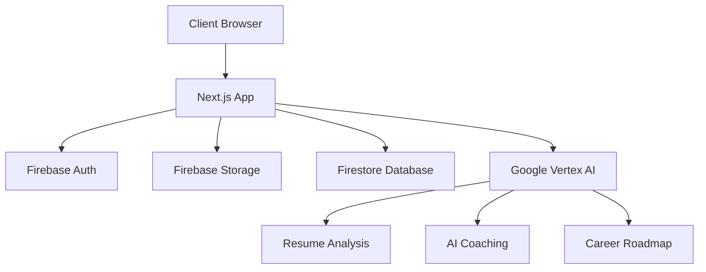
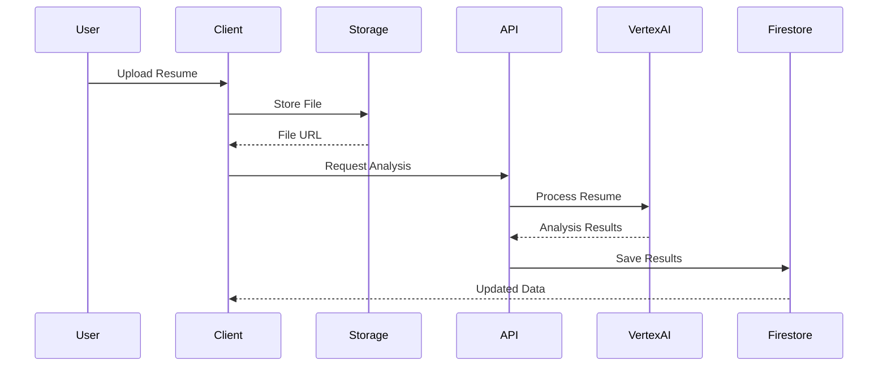
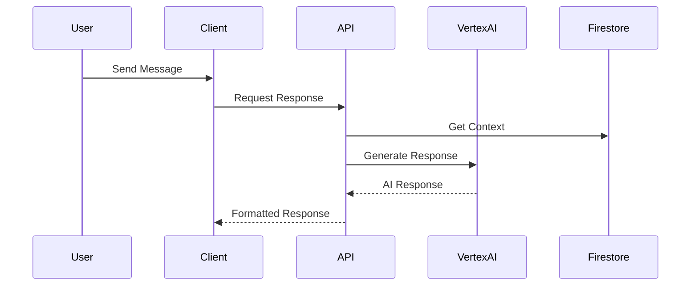

# TalentUnlock Architecture

## System Overview

TalentUnlock is built as a modern web application using Next.js 14+ with the App Router. The architecture follows a client-server model with serverless functions and cloud services.

## Core Components

### Frontend Architecture

1. **App Router (`/app`)**
   - Page components with server-side rendering
   - API routes for backend functionality
   - Layout components for consistent UI

2. **Components (`/components`)**
   - Reusable UI components
   - Feature-specific components
   - Shared components like navigation and loading states

3. **State Management**
   - React Context for global state
   - Custom hooks for component logic
   - Local state for component-specific data

### Backend Services

1. **Firebase Services**
   - Authentication with Google Sign-in
   - Cloud Storage for resume files
   - Firestore for user data and analysis results

2. **Google Vertex AI**
   - Resume analysis and skills extraction
   - Career coaching conversations
   - Roadmap generation

3. **Next.js API Routes**
   - RESTful endpoints for client-server communication
   - File upload handling
   - AI service integration

## Data Flow

### Resume Upload Flow

### AI Coaching Flow

## Security

1. **Authentication**
   - Firebase Authentication
   - JWT token validation
   - Protected API routes

2. **Data Protection**
   - Secure file storage
   - Encrypted data transmission
   - Role-based access control

3. **API Security**
   - Rate limiting
   - CORS configuration
   - Input validation

## Performance Optimization

1. **Frontend**
   - Dynamic imports
   - Image optimization
   - Component lazy loading
   - Client-side caching

2. **Backend**
   - API response caching
   - Efficient database queries
   - Optimized file processing

3. **Infrastructure**
   - CDN integration
   - Regional deployment
   - Auto-scaling

## Monitoring and Logging

1. **Error Tracking**
   - Client-side error logging
   - API error monitoring
   - Service health checks

2. **Performance Metrics**
   - Page load times
   - API response times
   - Resource utilization

3. **User Analytics**
   - Usage patterns
   - Feature adoption
   - Error rates

## Development Guidelines

1. **Code Organization**
   - Feature-based directory structure
   - Shared utilities and types
   - Component modularity

2. **Testing Strategy**
   - Unit tests for utilities
   - Component testing
   - Integration tests
   - E2E testing

3. **Deployment Process**
   - Continuous integration
   - Automated testing
   - Staged deployments 